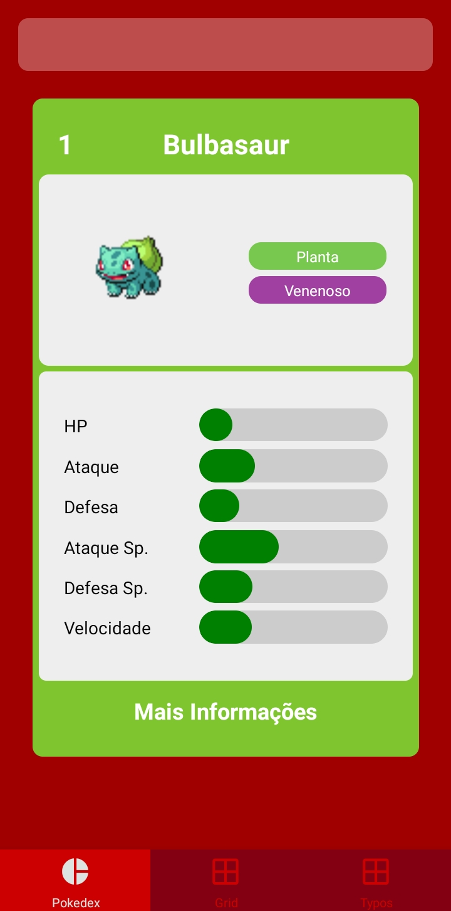
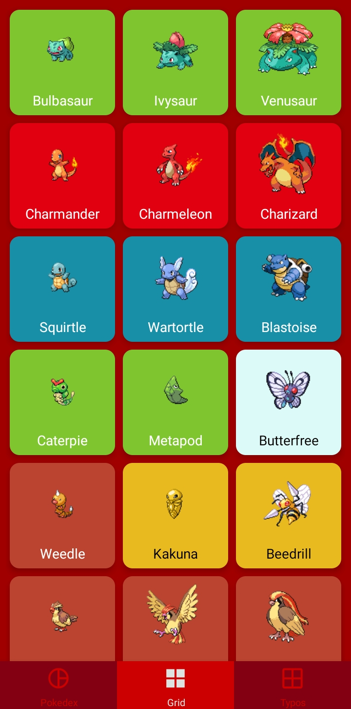
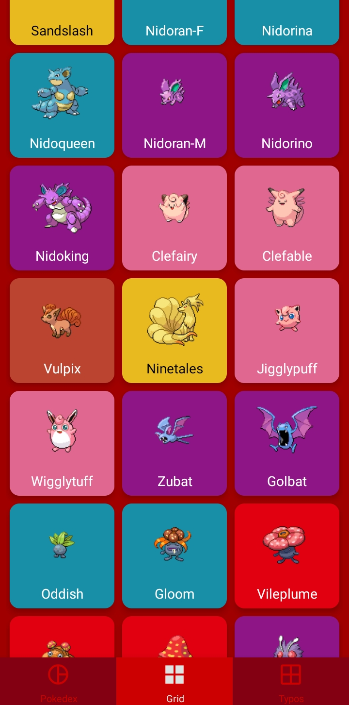
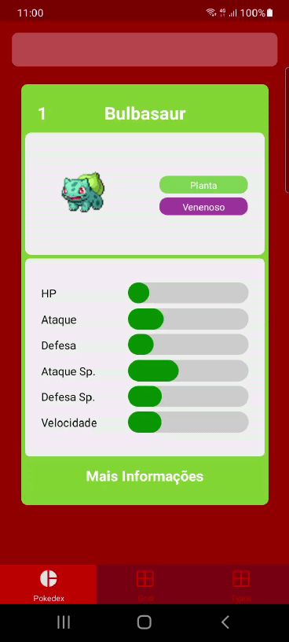
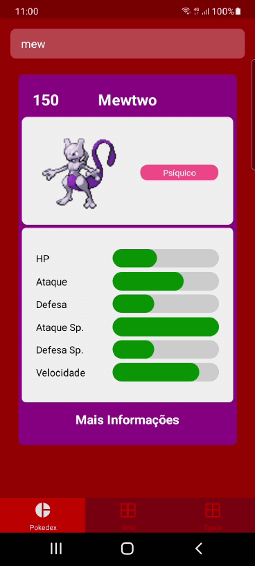

# Pokédex

## About the project
Project made using React Native to test version 5.x of [React Navigation](https://reactnavigation.org) and using data previously fetched and manipulated from [PokéAPI](https://pokeapi.co/).

## Built with
- [React Native](https://reactnative.dev/)
- [React Navigation](https://reactnavigation.org)
- [React Navigation Shared Element](https://github.com/IjzerenHein/react-navigation-shared-element): To allow smooth transitions between main screen and details screen.
- [FastImage](https://github.com/DylanVann/react-native-fast-image): To load and cache all the 700+ images and make the scroll and transitions more responsive.
- [react-native-snap-carousel](https://github.com/meliorence/react-native-snap-carousel): A component built on top of Flatlist to allow snap effect when moving between Pokémon cards.

## Showcase

  

 

----------

Click on the image below to see the screen recording:

----------
